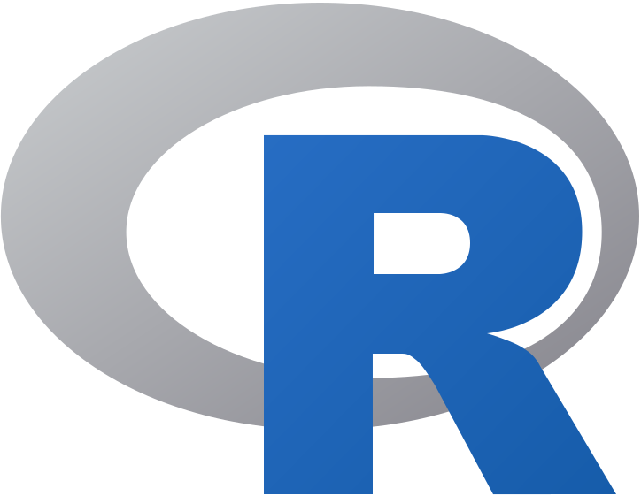

<h1> Hello there! </h1>
</h1>

👋  I am Stelios (he/him)  
📚  Student of Statistics and Insurance Science  
💻  Coding with   
🧪  Experimenting with  and   
📊  Constantly developing my dataviz & Shiny skills

Mostly interested in [Rstats](https://www.r-project.org/), [Shiny](https://shiny.posit.co/), [Quarto](https://github.com/quarto-dev/quarto-cli) & [ggplot2](https://ggplot2.tidyverse.org/).
 

  
<i>You can see my projects in a 🧹 <b>tidy</b> 🧹 way by clicking here!</i> 

  
<table>
<tr>
<th> Data Scraping </th>
<th> Data Analysis </th>
<th> Web Apps </th>
</tr>
<tr>
<td>
   - <a href="https://www.example.com">Project 1</a>  
   - <a href="https://www.example.com">Project 2</a>  
   - <a href="https://www.example.com">Project 3</a>
</td>
<td>
   - <a href="https://www.example.com">Project 1</a>  
   - <a href="https://www.example.com">Project 2</a>  
   - <a href="https://www.example.com">Project 3</a> 
</td>
<td>
   - <a href="https://www.example.com">Project 1</a>  
   - <a href="https://www.example.com">Project 2</a>  
   - <a href="https://www.example.com">Project 3</a>
</td>
</tr>
</table>

<table>
<tr>
<th> API </th>
<th> Data Viz </th>
</tr>
<tr>
<td>
   - <a href="https://www.example.com">Project 1</a>  
   - <a href="https://www.example.com">Project 2</a>  
   - <a href="https://www.example.com">Project 3</a>
</td>
<td>
   - <a href="https://www.example.com">tidytuesday</a>  
   - <a href="https://www.example.com">Greece in Figures</a>  
   - <a href="https://www.example.com">EU in Figures</a>
</td>
</tr>
</table>

