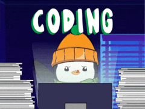

<h2> Hello there! </h2>
</h1>

👋  I am Stelios (he/him)  
📚  Student of Statistics and Insurance Science  
💻  Coding with   
🧪  Experimenting with  and   
📊  Constantly developing my dataviz & Shiny skills

Mostly interested in [Rstats](https://www.r-project.org/), [Shiny](https://shiny.posit.co/), [Quarto](https://github.com/quarto-dev/quarto-cli) & [ggplot2](https://ggplot2.tidyverse.org/).
 

#### Tidying my Projects :

 ├── 📊 <b>Visualization-Projects</b>  
 ├ &nbsp;&nbsp;&nbsp;&nbsp;&nbsp;&nbsp;&nbsp;&nbsp;&nbsp;&nbsp;&nbsp;&nbsp; ├── 📠[30 Day Chart Challenge](https://github.com/stesiam/30DayChartChallenge)  
 ├ &nbsp;&nbsp;&nbsp;&nbsp;&nbsp;&nbsp;&nbsp;&nbsp;&nbsp;&nbsp;&nbsp;&nbsp; ├── 📠[Tidy Tuesday](https://github.com/stesiam/tidytuesday)  
 ├ &nbsp;&nbsp;&nbsp;&nbsp;&nbsp;&nbsp;&nbsp;&nbsp;&nbsp;&nbsp;&nbsp;&nbsp; ├── 📠[Greece in Figures](https://github.com/stesiam/Greece-In-Figures)   
 ├ &nbsp;&nbsp;&nbsp;&nbsp;&nbsp;&nbsp;&nbsp;&nbsp;&nbsp;&nbsp;&nbsp;&nbsp; └── 📠[EU in Figures](https://github.com/stesiam/EU-In-Figures)   
 ├── 🌠<b>Web Apps</b> 
 ├ &nbsp;&nbsp;&nbsp;&nbsp;&nbsp;&nbsp;&nbsp;&nbsp;&nbsp;&nbsp;&nbsp;&nbsp; ├── 📠[Ageing Dashboard](https://github.com/stesiam/AgeingDashboard)   
 ├── 🌠<b>API Development</b> 
 ├ &nbsp;&nbsp;&nbsp;&nbsp;&nbsp;&nbsp;&nbsp;&nbsp;&nbsp;&nbsp;&nbsp;&nbsp; ├── 📠[Glass API](https://github.com/stesiam/GlassAPI)   
 ├ &nbsp;&nbsp;&nbsp;&nbsp;&nbsp;&nbsp;&nbsp;&nbsp;&nbsp;&nbsp;&nbsp;&nbsp; ├── 📠[Dev API](https://github.com/stesiam/GlassAPI) âš’ï¸âš’ï¸  
 ├── 🗒️ <b>Posters</b> 
 ├ &nbsp;&nbsp;&nbsp;&nbsp;&nbsp;&nbsp;&nbsp;&nbsp;&nbsp;&nbsp;&nbsp;&nbsp; ├── 📠[posterMaths](https://github.com/stesiam/posterMaths)  
 ├ &nbsp;&nbsp;&nbsp;&nbsp;&nbsp;&nbsp;&nbsp;&nbsp;&nbsp;&nbsp;&nbsp;&nbsp; ├── 📠[Summary Distributions](https://github.com/stesiam/Summary-Distributions)
